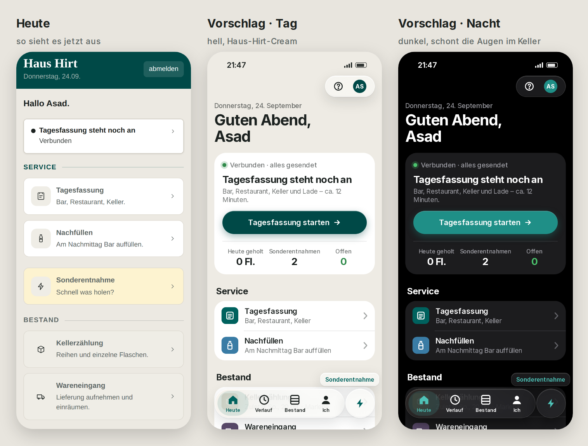
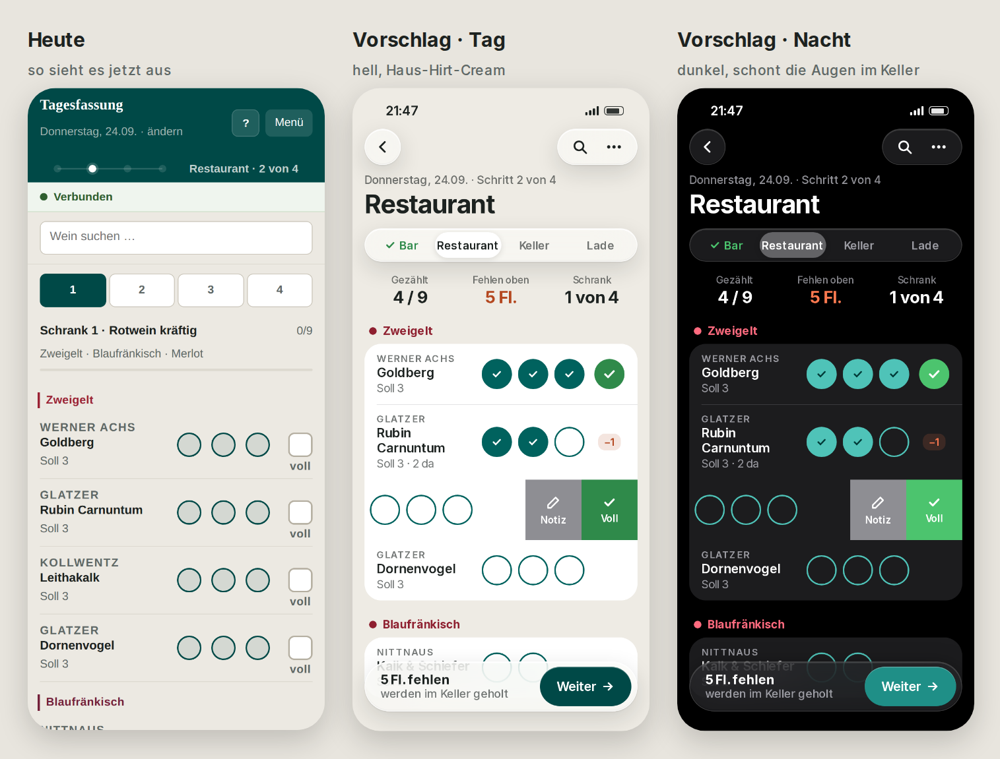
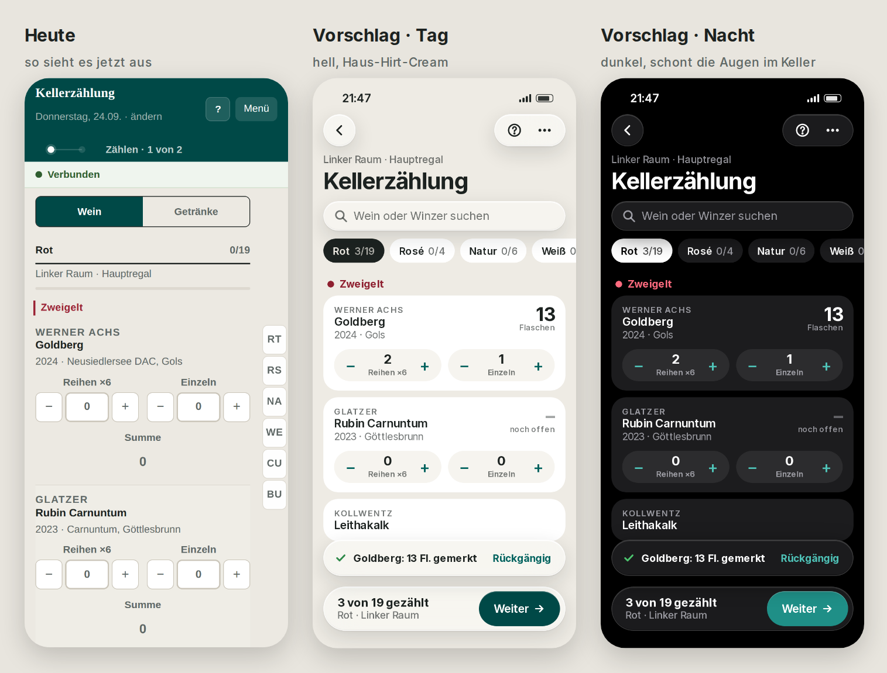
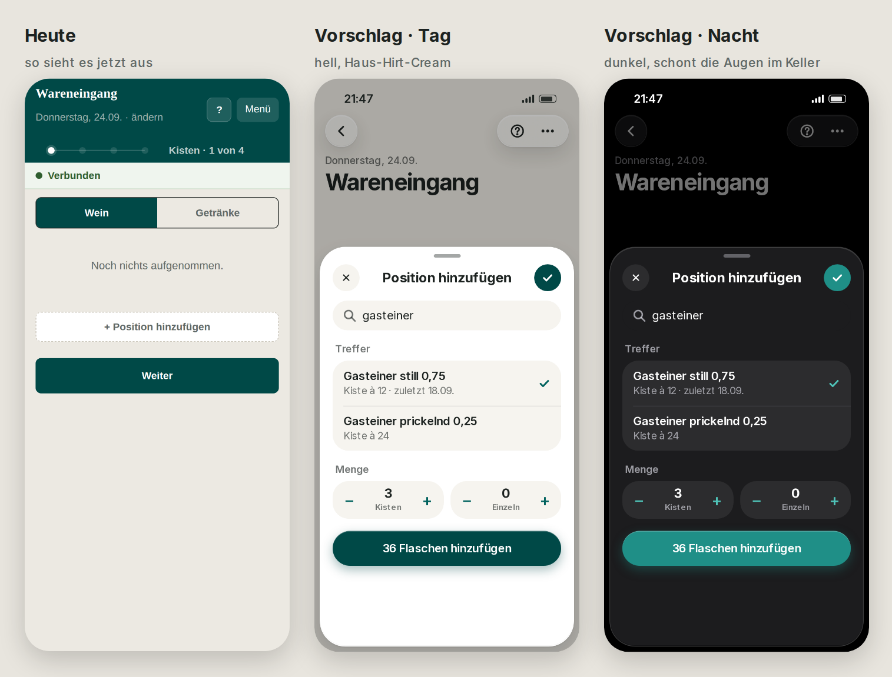
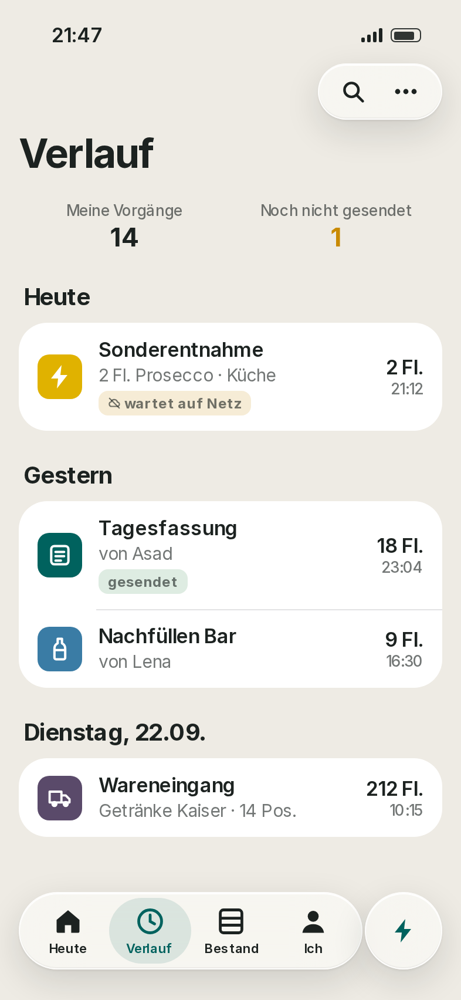
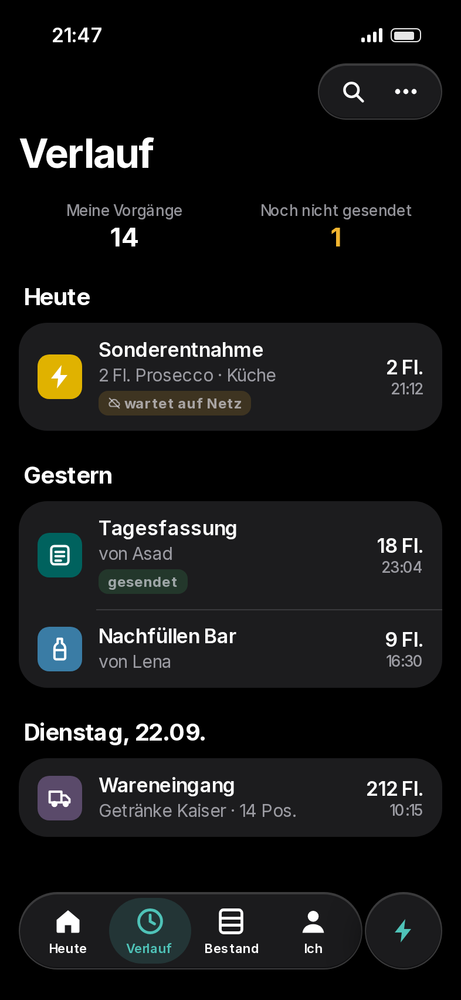
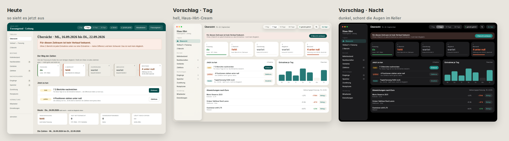

# Übergabe · Neues Aussehen im Apple-Stil (Liquid Glass + Nacht)

**Stand:** 23./24.09.2026 · Nachtschicht · **nur Vorschlag, nichts ist live, kein Code der App geändert.**
Bilder: `review/mockup/apple/bilder/` · Entwurf zum Selbst-Öffnen: `review/mockup/apple/mock.html?s=start&t=nacht`
(`s` = start · fassung · keller · ware · verlauf · leitung, `t` = hell · nacht).
Ist-Bilder des heutigen Stands: `review/screens/ist-nacht/`.

---

## 1 · In einem Satz

Das Tool soll sich anfühlen wie eine gute iPhone-App (tricount, Apple-Apps): große Überschrift,
runde Karten, schwebende Glasleisten unten, ein Knopf für das Wichtigste – und **automatisch dunkel**,
wenn das iPhone dunkel ist. Die Haus-Hirt-Farben bleiben.

## 2 · Vorher / Nachher

**Start** – statt fünf gleich großer Kacheln: eine Karte „Was jetzt dran ist" mit großem Knopf,
darunter gruppierte Listen wie in den iPhone-Einstellungen, unten eine schwebende Leiste.

**Tagesfassung** – Schritte als Glas-Umschalter (Bar ✓ · Restaurant · Keller · Lade), drei Zahlen oben
wie bei tricount („Gezählt · Fehlen oben · Schrank"), Zählpunkte fluchten in jeder Zeile,
**Wischen nach links** = „Voll" oder „Notiz". Unten schwebt „Weiter" mit der Fehlmenge.

**Kellerzählung** – Suche + Filterchips (Rot 3/19 · Rosé · Weiß …) statt der Kästchen am Rand,
iPhone-Zähler (− 2 +) statt sechs Einzelknöpfen, Summe groß rechts.
Nach jeder Eingabe kurz „Goldberg: 13 Fl. gemerkt · **Rückgängig**".

**Wareneingang** – leere Seite erklärt, was zu tun ist; „Position hinzufügen" kommt als
**Blatt von unten** (wie Apple Karten/Mail) mit Suche, Treffern und Zähler; der Knopf nennt das Ergebnis
(„36 Flaschen hinzufügen").

**Verlauf (neu)** – wie die Ausgabenliste bei tricount: Heute · Gestern · Dienstag,
jede Zeile mit Symbol, Menge, Uhrzeit – und **„wartet auf Netz"**, solange etwas noch nicht gesendet ist.
 

**Backoffice (MacBook)** – Seitenleiste als schwebende Glasplatte wie in macOS, Zeitraum als
Glas-Umschalter oben, Karten mit Fortschrittsbalken, neu „Abweichungen nach Euro" mit Knopf „Beleg ›".

## 3 · Was wir von tricount und iOS übernehmen

| Muster | Wo im Tool | Nutzen im Alltag |
|---|---|---|
| Schwebende Tableiste (Heute · Verlauf · Bestand · Ich) | App | ein Daumen, immer gleicher Ort |
| Runder Schnellknopf ⚡ rechts daneben | Sonderentnahme | „schnell was holen" in 1 Tipp von überall |
| Große Überschrift + runde Glasknöpfe oben (‹ · ? · …) | alle Schritte | kein „Menü"-Kasten mehr, wirkt ruhiger |
| Drei Zahlen oben (wie „Meine Ausgaben / Gesamt") | Fassung, Keller, Verlauf | Stand ohne Scrollen |
| Wischen nach links | Zählzeilen | „voll", „Notiz" ohne Zielen |
| Rückgängig-Hinweis | nach jeder Eingabe | keine Angst vor Vertippen |
| Blatt von unten statt Vollbild | Wareneingang, Sonderentnahme, Freigabe | man verliert die Liste nicht |
| Zähler − n + | Keller, Wareneingang | weniger Knöpfe, größere Griffe |
| Suche + Filterchips | Keller, Tagesfassung | schneller zum Wein |
| Verlauf nach Tagen | neu | sieht, was offline wartet – heute unsichtbar |
| Dunkelmodus automatisch | App + Backoffice | im Keller und spät abends angenehmer |

## 4 · Was bleibt, wie es ist

- Haus-Hirt-Teal, Cream als heller Grund, Cormorant nur noch für „Haus Hirt".
- Nichts unter 15 px im Service, jeder Griff mindestens 44 px, Kontrast 4,5:1 – auch auf Glas und im Dunkeln.
- Laufweg-Reihenfolge, Schritte, Zahlen, Offline-Verhalten, Rechte: **unverändert**. Es ist nur die Hülle.
- Weiter genau vier Dateien, kein Bauschritt, keine neue Abhängigkeit.
  Die Gestaltungsschicht bleibt wortgleich in App und Backoffice.

## 5 · Ehrliche Grenzen

- **Echtes Liquid Glass (Lichtbrechung, Wackeln) gibt es nur in echten Apps.** Im Browser geht:
  Milchglas-Unschärfe + Glanzkante. Sieht auf dem iPhone sehr nah dran aus, ist aber nicht identisch.
- **Glas nur auf Leisten und Knöpfen**, nicht auf Listen – sonst ruckelt es auf älteren iPads und
  der Text wird schlechter lesbar.
- **Vibration beim Tippen** kann Safari nicht.
- Die Bilder zeigen Inter als Ersatz für die Apple-Schrift; auf dem iPhone käme die echte Systemschrift (SF).
- Wischgesten brauchen immer auch einen sichtbaren Weg (langes Drücken / Knopf), sonst findet sie niemand.

## 6 · Umsetzung in Etappen (je eine Runde, jede für sich live-fähig)

| # | Inhalt | Größe | Risiko |
|---|---|---|---|
| 1 | Farben neu + **Dunkelmodus** (automatisch, Schalter Tag/Nacht/Auto unter „Ich") + Systemschrift | M | klein – nur Gestaltungsschicht |
| 2 | Kopf mit Glasknöpfen, große Überschrift, schwebende Unterleiste mit „Weiter" | M | mittel – jeder Schritt betroffen |
| 3 | Startseite neu + Tableiste + ⚡-Knopf | M | klein |
| 4 | Zählzeilen, Zähler − n +, Filterchips, Blätter von unten | L | mittel – Zählen ist das Herz, gründlich testen |
| 5 | Rückgängig-Hinweis + Wischen | S | klein |
| 6 | **Verlauf** (Daten gibt es schon: Server-Liste der Vorgänge + Ausgang am Gerät) | M | klein |
| 7 | Backoffice: Glas-Seitenleiste, Karten, „Abweichungen nach Euro" mit Beleg | L | mittel |

Empfehlung: mit **1 (Nacht)** anfangen – größter Effekt, kleinstes Risiko, und die Mannschaft
merkt sofort den Unterschied.

## 7 · Fragen an Casimir (bitte kurz beantworten)

1. **Schrift:** Apple-Systemschrift überall (wirkt am meisten „iPhone") – oder Barlow behalten?
2. **Tableiste unten** (Heute · Verlauf · Bestand · Ich) – ja? Oder bleibt die Startseite der einzige Einstieg?
3. **Nacht:** automatisch nach iPhone-Einstellung (Vorschlag) – oder im Keller immer dunkel?
